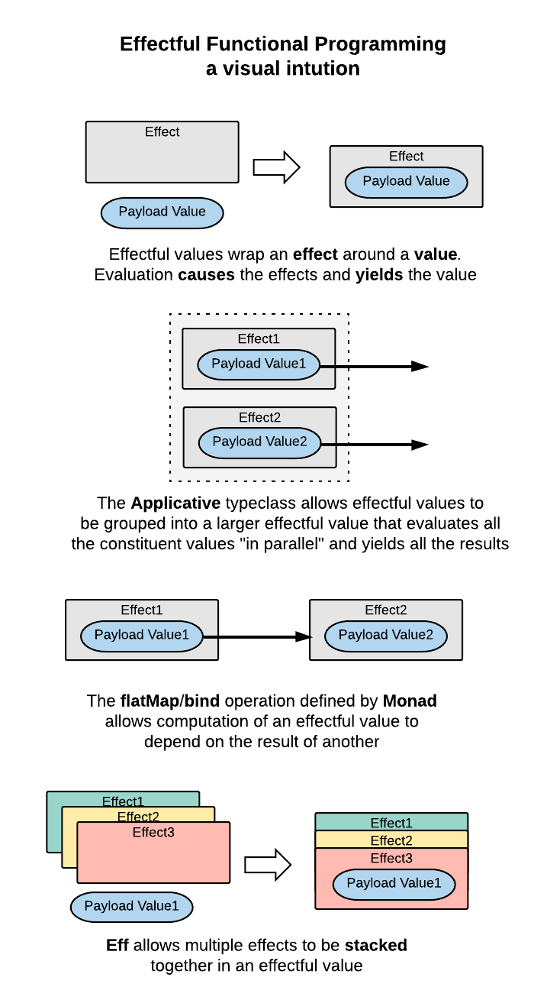

# Getting Work Done With Effectful Functional Programming

A workshop on programming with *Effectful Functional Programming*. This can be described as a style of pure functional programming
emphasizing the use of *effects*. It readily handles the complex or messy programming problems that are often encountered in industry.

It has a close connection to the [Monad](https://typelevel.org/cats/typeclasses/monad.html) and
[Applicative](https://typelevel.org/cats/typeclasses/applicative.html) type classes, as they are how we build large effectful
programs out of small effectful programs.

### What are Effects?

So what's a "effect" then? Like many abstract concepts, it is best grasped by seeing many examples, as we'll do in this workshop.
But here's a brief overview:

- Recall that functional programs can only act upon the world through the values they compute.
- Effectful function programs compute *effectful functional values*, which have the form `F[A]`.
- The type `A` in `F[A]` represents the pure payload value the program computes.
- The type that wraps around it, `F[_]`, represents the effects that the program must resolve in order to, or additional to, yielding
 the `A` payload.

It turns out that a huge variety and complexity of different program behaviours can be represented as an effectful value `F[A]`.

<details>
  <summary>Expand diagram: Effectful Functional Programming - a visual intuition</summary>
  <p>

  

  </p>
</details>


### Libraries

The workshop consists of a series of practical exercises using the following open source libraries:
- [Cats](https://typelevel.org/cats/)
- [Eff](https://github.com/atnos-org/eff)
- [Monix](https://monix.io/)
- [Monocle](http://julien-truffaut.github.io/Monocle/)
- [Cats Effect](https://github.com/typelevel/cats-effect)

### Use Case

Each exercise is an alternate implementation of the same use case:

*Ever had a full disk? Where does the space go? Implement a program that can find the largest N files in a directory tree*


## Setup

- Wifi/Internet required.

- You will need Java 8+ and Simple Build Tool (`sbt`) [installed](http://www.scala-sbt.org/release/docs/Setup.html).

- While SBT will download Scala and the Eff libraries on-demand, this can be a slow process. Before the workshop, it is recommended
to run `sbt update` in the base directory to pre-download the required libraries. This may take a few minutes up to 1 hour,
depending what you have cached locally in `~/.ivy2/cache`.

- Import the base SBT project into your IDE: [Intellij](https://www.jetbrains.com/help/idea/2016.1/creating-and-running-your-scala-application.html),
[Eclipse ScalaIDE](http://scala-ide.org/) or [Ensime](http://ensime.org/).

- Or work with any editor and the SBT command line if you prefer.

  *Be warned that IDE presentation compilers don't correctly handle some Eff code*, and may
flag valid code as invalid. Try your code with the full Scala compiler via SBT command line before concluding there is a problem.

## Exercises

The SBT base project contains nine exercise projects, each with a README with instructions to attempt. Each of them contains
a different implementation of a file scanner program.

It is suggested to do the exercises in this order. The instruction pages are best viewed in a browser; reach them here:
- [Classic](exerciseClassic/README.md) - File Scanning in a classic Scala style
- [Task effect](exerciseTask/README.md) - Using Monix task effect to defer execution
- [Reader effect](exerciseReader/README.md) - Using Reader effect for dependency injection and abstracting the environment
- [Error effect](exerciseError/README.md) - Using Either effect for error handling
- [Writer effect](exerciseWriter/README.md) - Using Writer effect for logging
- [State effect](exerciseState/README.md) - Using State effect to keep track of Symlinks encountered
- [Concurrency](exerciseConcurrency/README.md) - Scanning directories in parallel with applicative traversal
- [Optics](exerciseOptics/README.md) - Using Optics to change the focus of a Reader effect
- [Custom Effects](exerciseCustom/README.md) - Using a custom Filesystem effect


There are three types of tasks you'll encounter
- :mag: _Study Code_ Study existing application and test code
- :pencil: _Write Code_ Adding missing code or changing existing code at an indicated line or method.
- :arrow_forward: _Run Code_ Run the file scanner (eg `exercise1/run`) or the unit tests (eg `exercise1/test`) from SBT prompt.

Each project can be compiled, run or tested separately; errors in one project won't affect the others.

*Initially, most exercises will not compile and/or run, until you complete the specified tasks. To try running the code,
go to the corresponding `solutions` project. *

## Solutions

There is a [solutions](solutions/) subfolder containing corresponding solution subprojects.

There is learning value in attempting a hard problem, getting stuck, then reviewing the solution.
Use the solutions if you get blocked!

## Using SBT

Start SBT in the base directory and then operate from the SBT prompt. Invoking each
SBT command from the shell (eg `sbt exercise1/compile`) is slower due to JVM startup costs.
```
/Users/ben_hutchison/projects/GettingWorkDoneWithExtensibleEffects $ sbt
Getting org.scala-sbt sbt 0.13.13 ...
..further sbt loading omitted..
>
```

To list all exercise- and solution- subproject names:
```
> projects
```

Try running the file scanner (ie `main` method) of subproject `solutionExerciseClassic` on the current directory.
```
> solutionExerciseClassic/run .
```

To compile sources in subproject `exercise1`:
```
> exerciseClassic/compile
```

To run any unit tests (in `src/test/scala/*`) under subproject `exerciseClassic`
```
> exerciseClassic/test
```


*SBT commands should be scoped to a subproject (eg `exerciseClassic/test`). Running eg `test` at the top level will load
10 copies of the classes into the SBT JVM, potentially leading to `OutOfMemoryError: Metaspace`*


## "Learn by Doing"

This project teaches Extensible Effects in practice; what it feels like to code with the Eff framework.

It doesn't make any attempt to cover
the complex, subtle theory behind Eff, a refinement of 25 years experience of programming with monads, and isn't a complete picture of Eff
by any means. At the time of writing however, there are more resources available covering the theory, than practice, of Eff, including:

- The original paper [Extensible effects: an alternative to monad transformers](https://www.cs.indiana.edu/~sabry/papers/exteff.pdf)
in Haskell and followup refinement [Freer Monads, More Extensible Effects](http://okmij.org/ftp/Haskell/extensible/more.pdf).

- [Video presentation](https://www.youtube.com/watch?v=3Ltgkjpme-Y) of the above material by Oleg Kiselyov

- [The Eff monad, one monad to rule them all](https://www.youtube.com/watch?v=KGJLeHhsZBo) by Eff library creator Eric Torreborre

- My own video [Getting Work Done with the Eff Monad in Scala](https://www.youtube.com/watch?v=LhGq4HlozV4)

## Workshop History

April 2017

* Initial version based on Eff 4.3.1, cats 0.9.0 and Monix 2.2.4. Includes 5 exercises introducing
`Reader`, `Either`, `Task` and `Writer` effects.

* Presented at [Melbourne Scala meetup](https://www.meetup.com/en-AU/Melbourne-Scala-User-Group/events/240544821/)

May 2017

* Presented at for [YOW Lambdajam 2017, Sydney](http://lambdajam.yowconference.com.au/archive-2017/ben-hutchison-3/)

April 2018

* Upgrade libraries to Eff 5.2, Monic 3.0, cats 1.1, sbt 1.1 and introduce Cats Effect 0.10.1 library to use IO effect
rather than Task, and Monocle 1.5 optics library.

* Rewrite existing exercises 1 - 5 to reflect updated libraries, slightly changed emphasis. Add three new exercises covering
State, Optics and Custom effects

May 2018

* Presented at [Melbourne Scala meetup](https://www.meetup.com/en-AU/Melbourne-Scala-User-Group/)


